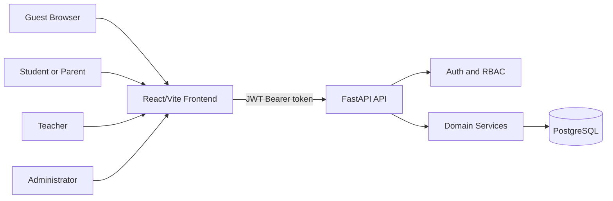

# Digital Urpaq Architecture

## System Overview

Digital Urpaq is split into three deployable services:

1. **Frontend Web App**: React/Vite TypeScript single-page application.
2. **Backend API**: FastAPI application exposing REST endpoints under `/api`.
3. **Database**: PostgreSQL with normalized relational tables managed through SQLAlchemy models.

## Backend Layers

- `core`: settings, password hashing, JWT helpers, and RBAC utilities.
- `db`: SQLAlchemy engine, sessions, declarative base, and model registration.
- `models`: PostgreSQL table mappings.
- `schemas`: Pydantic request and response contracts.
- `api`: FastAPI dependencies and route modules.
- `services`: business logic such as club recommendation scoring.

## Frontend Layers

- `api`: typed API client and token handling.
- `components`: reusable UI building blocks.
- `layouts`: role-aware app shell and navigation.
- `pages`: routed screens for public, auth, student, teacher, and administrator workflows.
- `data`: realistic demo data used when the API is not available yet.

## Roles And Access

| Role | Capabilities |
| --- | --- |
| Guest | View clubs, announcements, and public materials |
| Student/Parent | Register, login, submit applications, view status, schedule, and assigned materials |
| Teacher | View assigned students, upload materials, publish announcements |
| Administrator | Full CRUD for clubs, users, applications, teachers, educational content, advertisements, and news |

## Authentication Flow

1. User registers through `/api/auth/register`.
2. User logs in through `/api/auth/login` using OAuth2 password form fields.
3. API returns a signed JWT access token.
4. Frontend stores the token and sends `Authorization: Bearer <token>`.
5. Protected routes resolve the current user through `/api/auth/me`.
6. RBAC dependencies enforce role-level access per endpoint.

## AI Recommendation Assistant

The MVP uses deterministic recommendation logic that behaves like an explainable AI assistant:

- Input: age, interests, skills.
- Source data: active clubs from PostgreSQL.
- Scoring: age fit, category match, keyword overlap, available seats, and enrollment status.
- Output: ranked recommendations with human-readable explanations.

This can later be upgraded to an LLM or embedding-based service without changing the public endpoint contract.

## Production Hardening Checklist

- Replace `SECRET_KEY` in production.
- Add Alembic migrations before multi-environment deployment.
- Add refresh tokens or session rotation if long-lived sessions are required.
- Add audit logs for administrative writes.
- Store file attachments in object storage such as S3-compatible storage.
- Add rate limiting for auth and AI recommendation endpoints.
- Enable HTTPS, secure cookies if cookie auth is introduced, and strict CORS origins.
