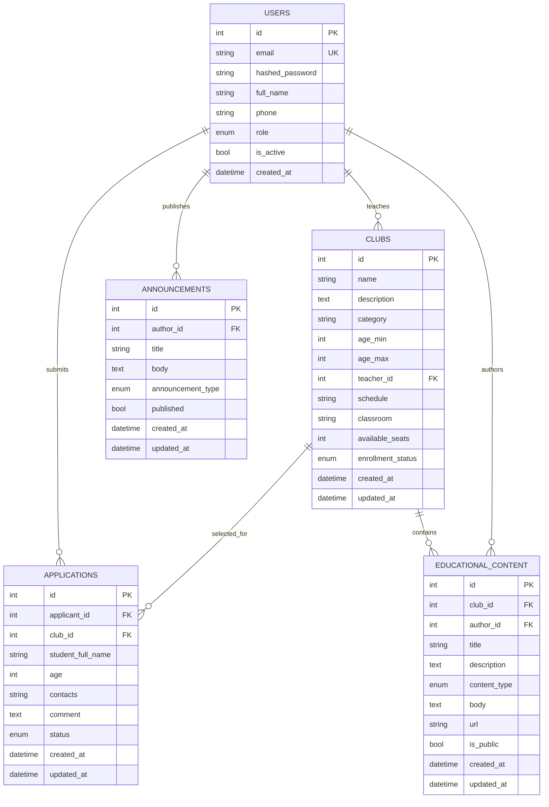

# Database ERD

## Normalization Notes

- Users are centralized and differentiated by role.
- Clubs reference teachers through `teacher_id`, so teacher assignment is not duplicated.
- Applications reference both applicant user and selected club.
- Educational content belongs to a club and has an author.
- Announcements are separate from educational content because they support banners, events, and success stories.
